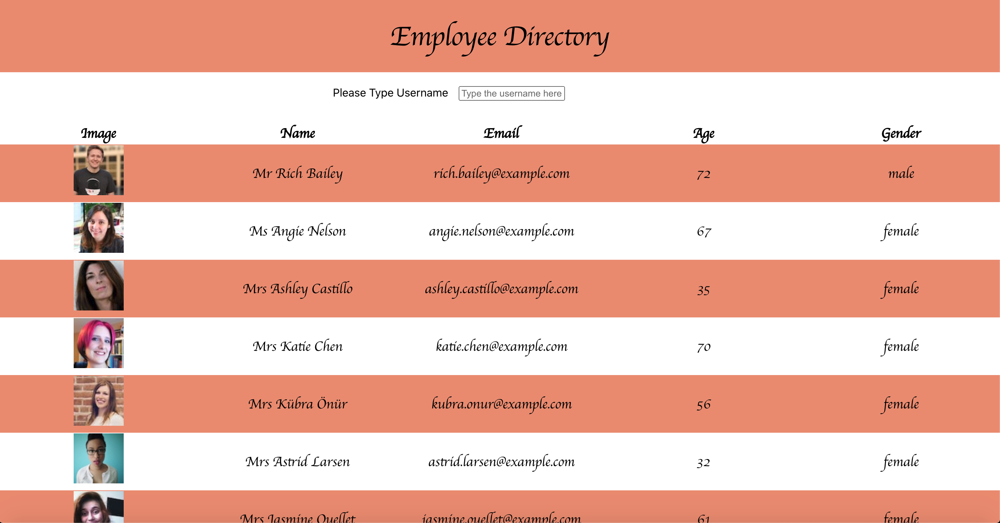
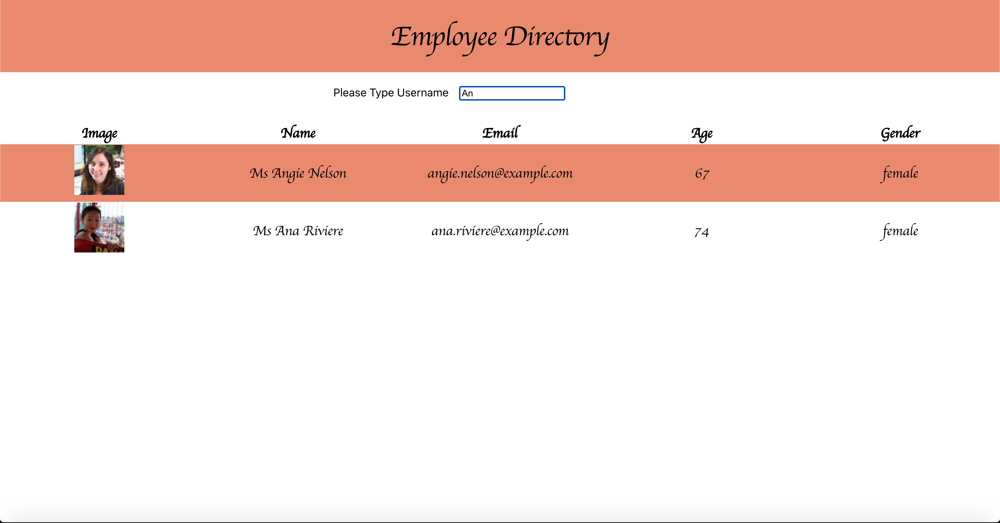

# Employee Directory
# Description
This project is made using React and RandomUsersAPI. 
In this app users can search through list of employees and in the directory user can view employees name, photo, age, gender and email.
In the photos below it shows the views that the user will be able to see:

You can also access the deployed app [here](https://gracee19.github.io/employee-directory/)

# Table Of Contents
  * [Description](#description)
  * [Installation](#installation)
  * [Usage](#usage)
  * [License](#license)
  * [Contributing](#contributing)
  * [Tests](#tests)
  * [Questions](#questions)
# Installation
npm install
npm axios
# Usage
npm start
# Licence 
MIT
# Contributors
grace
# Test 

# Questions 
 
For more information you can check my Github account gracee19(https://github.com/gracee19). 
Please don't hesitate to ask questions you can email me at .
